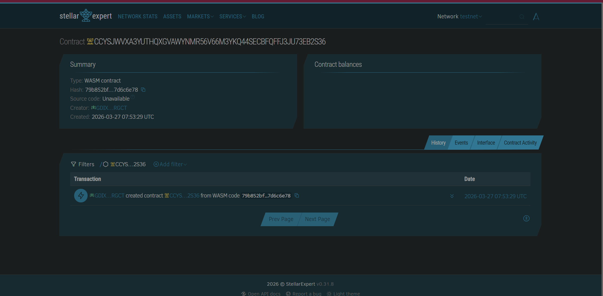

# 🚀 Crypto Subscriptions on Stellar (Soroban)

## 📌 Project Description

Crypto Subscriptions is a decentralized subscription system built using **Soroban smart contracts** on the Stellar network.

It enables users to pay for services using cryptocurrency through recurring payments — without relying on centralized platforms like Stripe or PayPal.

This project demonstrates how blockchain can power **trustless, automated subscription billing**.

---
## 📸 Demo

<p align="center">
  
</p>
## ⚙️ What It Does

This smart contract allows:

* Users to create subscriptions with a fixed payment amount and time interval
* Storage of subscription data directly on-chain
* Manual triggering of recurring payments (simulating automation)

Each subscription includes:

* User wallet address
* Payment amount
* Billing interval
* Last payment timestamp

---

## ✨ Features

* 🔐 Fully decentralized subscription system
* 💾 On-chain storage of subscription data
* ⏱️ Time-based payment logic
* 🔁 Recurring payment mechanism (manual trigger)
* ⚡ Built using Soroban (Stellar smart contracts)

---

## 📦 Smart Contract Overview

Main functions:

### `subscribe`

Create a new subscription

```rust
pub fn subscribe(env: Env, user: Address, amount: i128, interval: u64)
```

### `get_subscription`

Fetch subscription details

```rust
pub fn get_subscription(env: Env, user: Address) -> Option<Subscription>
```

### `trigger_payment`

Trigger recurring payment manually

```rust
pub fn trigger_payment(env: Env, user: Address)
```

---

## 🌐 Deployment

**Contract Address:**

```
CCYSJWVXA3YUTHQXGVAWYNMR56V66M3YKQ44SECBFQFFJ3JU73EB2S36
```

---

## 🛠️ Tech Stack

* **Stellar Soroban SDK**
* **Rust**
* **Blockchain (Stellar Network)**

---

## 🚀 Future Improvements

* 💸 Integrate real token payments (XLM / USDC)
* 📋 Support multiple subscription plans
* ❌ Add subscription cancellation
* 🔄 Automate recurring payments (cron / off-chain bots)
* 🌐 Build frontend dashboard (React + Stellar SDK)

---

## 🎯 Use Cases

* SaaS subscriptions
* Content platforms (Netflix-style)
* Membership services
* Web3 tools & APIs

---

## 📄 License

MIT License

---

## 🙌 Author

Built with ❤️ using Stellar Soroban
